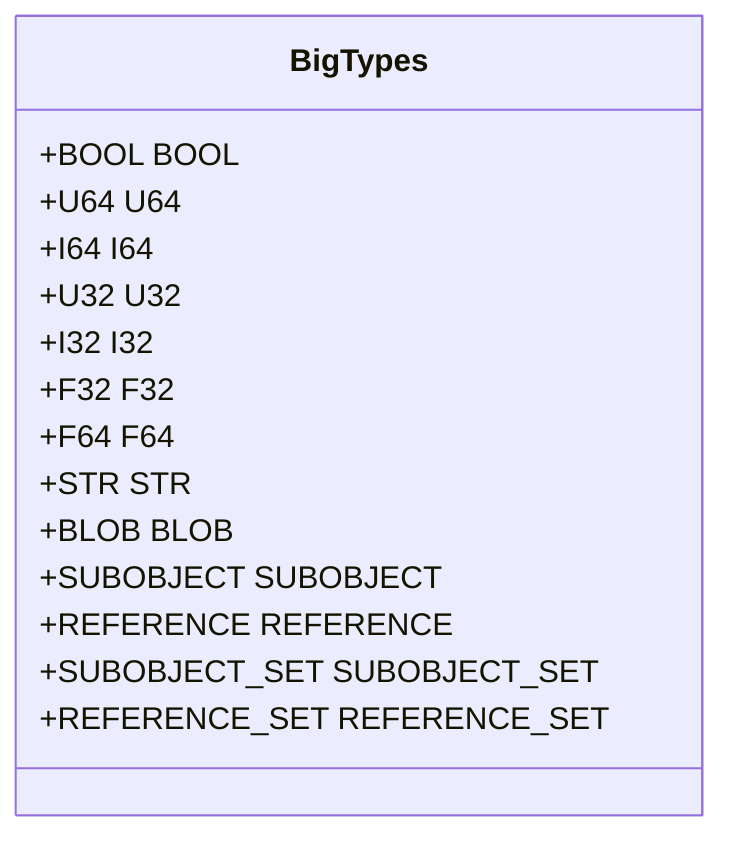
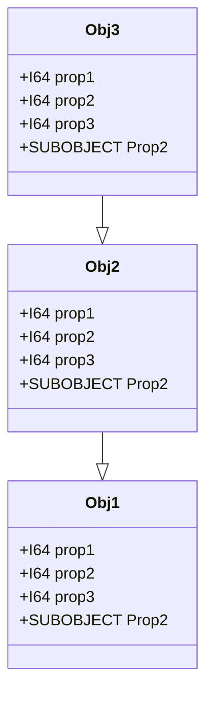

# CDB

CDB is in-memory-typed-object-with-props based DB that support prototypes and object/properties aspect.

- Object id defined as type with properties.
- Write clone object and swap it on commit.
- Reader is not disturbed if object is changed because reader are valid until GC phase.
- You should create object from another object as prototype and override some properties.
- Change on prototypes are visible in instances on not override properties.
- Type and properties should have named aspect interface as generic way to do some crazy shit like custom UI etc…

## Why

1. Writing UI is very time consumption task. More simple is "generate" it as default and extend it if needed.
2. Unified Data model is more robust for writing modular extensible application.
3. Modular system need some basic mechanism to safe share data and communicate with each other.

## Object Type

Object type is just mame + list of properties definition.
Type name is not used as string, but it's hashed to 64 integer and used to look-up type storage for object. (latter this
will be replaced with type_hash->type_idx and skip hash lookup)

## Object

Object has Type, ID and properties.

## Properties

Property is defined as name, idx and type.

### Types

| Type            | Description                      |
|-----------------|----------------------------------|
| `BOOL`          | Boolean                          |
| `U64`           | Unsigned int 64 bits             |
| `I64`           | Signed int 64 bits               |
| `U32`           | Unsigned int 32 bits             |
| `I32`           | Signed int 32 bits               |
| `F32`           | Float 32 bits                    |
| `F64`           | Float 64 bits                    |
| `STR`           | `\0` terminated string           |
| `BLOB`          | Binary blob of any size and type |
| `SUBOBJECT`     | Sub object                       |
| `REFERENCE`     | Reference to another object      |
| `SUBOBJECT_SET` | Set of sub object                |
| `REFERENCE_SET` | Set of references                |

## Prototypes

Any object can act as prototype for another if they have same type.
Instance share properties value this mean if property is changed on prototype then instance see this change.
If property is changed (override) on instance and property is changed on prototype instance is seen own property value.

Obj1 is prototype for Obj2 and Obj2 is prototype for Obj3

