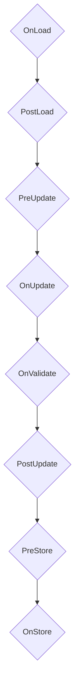

# Kernel

`Kernel` is main part and entry point for CeTech1. Public api is defined `src/cetech1/core/kernel.zig`
`Kernel` purpose is load and init all modules and run main loop that is make by separate [Phases](#update-phases).

## Kernel task

## Update phases

Kernel main loop call this phases for every tick.
Phases is executed in this serial order one by one.

